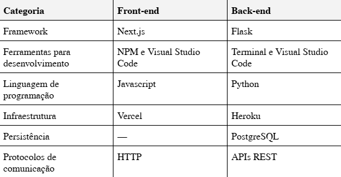
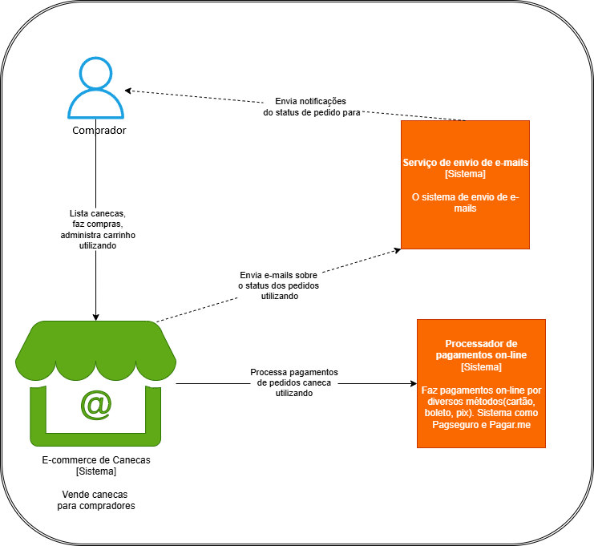
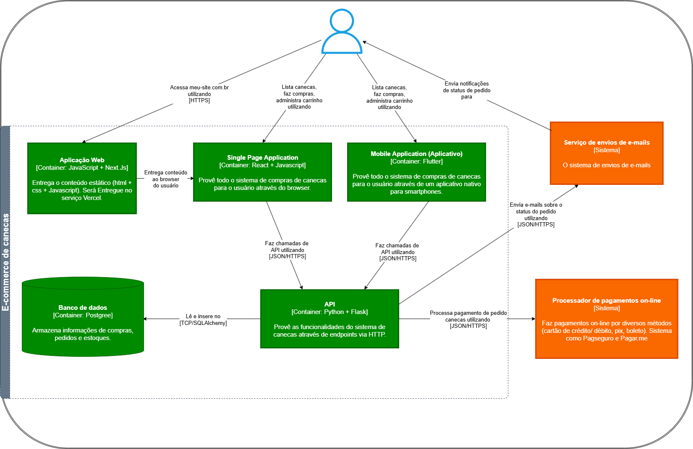

# Projeto Impacta Commerce
Projeto de desenvolvimento Full Stack para a criação de uma aplicação de vendas de canecas personalizadas.
### 1º Passo: Entender a necessidade do cliente.
Os usuários precisam comprar canecas personalizadas no site, 24h por dia. Precisam ver e escolher o produto. Precisam fazer um tipo de pagamento. Precisam ser avisados quando o pagamento der certo ou não e se o pedido vai seguir ou não.
### 2º passo: Definir os objetivos e o escopo do problema.
Construir uma aplicação web responsiva (se ajusta automaticamente a diferentes tamanhos e resolução de tela, como smartphones, tablets e desktop) e precisa prover a jornada do usuário para comprar os produtos.
### 3º passo: Requisitos funcionais e não funcionais.
Requisitos funcionais: Conseguir fazer um pedido de caneca, colocar no carrinho uma caneca ou mais de uma, conseguir ver uma lista de canecas disponíveis, tratar o estoque e não exibir canecas que não estão disponíveis, avisar o usuário sobre o status do pagamento.

Requisitos não funcionais: Usabilidade e confiabilidade da aplicação. Usabilidade como foi dito, ser uma aplicação responsiva para o usuário acessar o website de uma forma facilitada para conseguir acessar pelo celular ou por um browser. Confiabilidade precisa garantir ao usuário que o pagamento não foi perdido e que não será cobrado 2x.
### 4º passo: Premissa do projeto.

### 5º Passo: System design.
Como um desenvolvedor *full-stack*, após levantar os requisitos do sistema, entramos em uma etapa técnica mais complexa, onde os componentes e suas interações devem ser descritos, geralmente em forma de diagrama ou documentação escrita. Essa descrição é comumente chamada de *System Design*, ou projeto de sistema (em tradução livre).

A arquitetura de sistemas deixa claro para os desenvolvedores onde eles devem atuar, como eles devem se comunicar com os sistemas vizinhos e como os fluxos deverão percorrer e sensibilizar os sistemas desenvolvidos.

Fazer um bom *System Design* garante que o projeto seguirá de forma previsível, tecnicamente falando, deixando claro as responsabilidades dos sistemas, arquitetura utilizada, domínio do problema e interação entre componentes.
### 5.1 C4 Model.
O C4 Model consiste em quatro camadas hierárquicas que vão do mais abstrato ao mais detalhado:
1. Contexto: visão geral do sistema, mostrando sua relação com usuários e sistemas externos.
2. Containers: arquitetura de alto nível, distribuição de responsabilidades e tecnologias utilizadas.
3. Componentes: detalhamento interno de cada container, mostrando suas partes constituintes.
4. Código: implementação detalhada usando UML para representar classes e suas relações.
### Diagrama de Contexto

### Diagrama de Container

